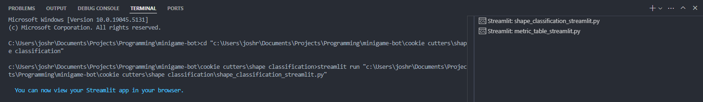

# Streamlit Runner for VS Code

A Visual Studio Code extension that allows you to run Streamlit apps directly from the context menu. Perfect for data scientists and developers who work with Streamlit frequently.

  

    
    
  

## Features

- Right-click any Python file and run it with Streamlit
- Each app runs in its own terminal, allowing multiple Streamlit apps to run simultaneously
- Clear terminal labeling with the running file name

## Requirements

- Visual Studio Code v1.93.0 or higher
- Python
- Streamlit (`pip install streamlit`)

## Usage

1. Right-click on any Python file in the VS Code explorer
2. Select "Run with Streamlit" from the context menu
3. The app will start in a new terminal window

## Extension Settings

This extension does not add any VS Code settings.

## Known Issues

None reported yet.

## Release Notes

### 0.0.1

Initial release of Streamlit Runner

## License

MIT